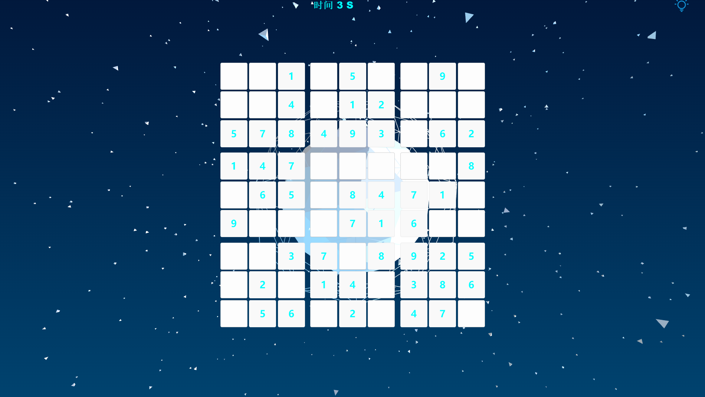

# Sudoku-Solo

This is a Sudoku game project, currently only supports single player play.

## Todo

-   [x] Put resource files into object storage to reduce the size of the release package.

## Usage

Please download the compressed package in the [Releases](https://github.com/CodingRookie98/Sudoku-Solo/releases) page, decompress it and run it.

## Features

1. Currently supports 4x4, 6x6, and 9x9 Sudoku.
2. 3D background animation, currently only supports two animations
3. Background music, currently there are 12 songs
4. Game save and load
5. Game settings
6. Multi-language, currently supports English and Chinese
7. Log module
